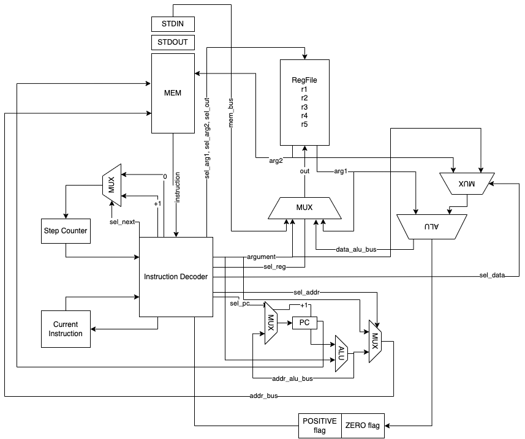

# Лабораторная работа №3 "На кончиках пальцев".

- Кузнецов Максим Александрович, гр. Р33131
- `asm | risc | neum | hw | tick | struct | stream | mem | prob2`

## Язык программирования

```ebnf
program ::= <section_text> <section_data> | <section_data> <section_text> | <section_text>

<section_data> ::= "section .data\n" <declaration>

<section_text> ::= "section .text\n" <instruction>

<declaration> ::= (<variable> | (<number> | <char>))

<instruction> ::= (<label> | <command>)

<name> ::= [a-zA-Z]+

<label> ::= "."<name> ":"

<variable> ::= <name> ":"

<reg=> ::= "r1" | "r2" | "r3" | "r4" | "r5"

<char> ::= "<ASCII symbol>"

<number> ::= [-2^64; 2^64 - 1]

<register_var_name> ::= <reg> ", " "(" <name> ")"

<var_name_register> ::=  "(" <name> ")" ", " <reg>

operation_3_args ::= ("ADD" | "SUB" | "DIV" | "MOD" | "MUL") " " ((<reg> ", " <reg> ", " <value>) | (<reg> ", " <reg> ", " <reg>))

operation_2_args ::= ("CMP" | "LD" | "ST" | "MOV") " " ((<reg> ", " <reg>) | (<reg> ", " "(" <name> ")") | ("(" <name> ")" ", " <reg>))

operation_1_arg ::= ("JMP" | "JE" | "JNE" | "JG" | "INC" | "DEC") " " (<label> | <reg>)

operation_0_args ::= "HLT"

<command> ::= <operation_3_args> | <operation_2_args> | <operation_1_arg> | <operation_0_args>
```

Поддерживаемые аргументы:

- **регистр** - `%r1`. Всего регистров 5 штук: r1, r2, r3, r4, r5.
- **метка** - `.count:`.
- **адрес памяти** - `#1`. Использование с зарезервированными адресами. Не использовать для переменных.
- **переменная** - `(name)`.
- **символ** - `'x'`. Транслируется в код ASCII.
- **целое число** в диапазоне [-2^64 ; 2^64 - 1].

Виды операций:

- **REGISTER** операция - может использовать в качестве операндов регистры, значения (символ, число). Первые операнды (до предпоследнего) регистры.
- **BRANCH** операция - может поддерживать метки в качестве операндов. Должна иметь 1 операнд-метку.
- **MEM** операция - может поддерживать адреса и имена переменных в качестве операндов. Один из операндов должен быть регистром

Код находится в `section .text` и выполняется последовательно. Виды операций:

- `ADD <arg1> <arg2> <arg3>` -- прибавить к `<arg2>` `<arg3>`, результат поместить в `<arg1>`. **REGISTER** операция.
- `SUB <arg1> <arg2> <arg3>` -- вычесть из `<arg2>` `<arg3>`, результат поместить в `<arg1>`. **REGISTER** операция.
- `DIV <arg1> <arg2> <arg3>` -- целая часть от деления `<arg2>` на `<arg3>`, результат поместить в `<arg1>`. **REGISTER** операция.
- `MOD <arg1> <arg2> <arg3>` -- остаток от деления `<arg2>` на `<arg3>`, результат поместить в `<arg1>`. **REGISTER** операция.
- `MUL <arg1> <arg2> <arg3>` -- произведение `<arg2>` на `<arg3>`, результат поместить в `<arg1>`. **REGISTER** операция.
- `MOV <arg1> <arg2>` -- скопировать значение `<arg2>` в `<arg1>`. **REGISTER** операция.
- `CMP <arg1> <arg2>` -- результат сравнения `<arg2>` с `<arg1>` (0, если аргументы равны). **REGISTER** операция.
- `LD <arg1> <arg2>` -- загрузить в `<arg1>` `<arg2>`. `<arg2>`может выступать только адресом или именем ячейки, `<arg1>` может выступать только регистром. **REGISTER** операция, **MEM** операция.
- `ST <arg1> <arg2>` -- загрузить `<arg2>` `<arg1>`. `<arg1>` может выступать только адресом или именем ячейки, `<arg2>` может выступать только регистром. **REGISTER** операция, **MEM** операция.
- `INC <arg>` -- инкрементировать операнд (+1). Может иметь в качестве операнда только регистр. **REGISTER** операция.
- `DEC <arg>` -- декрементировать (-1) операнд. Может иметь в качестве операнда только регистр. **REGISTER** операция.
- `JE <label>` -- если результат предыдущей операции равен 0, перейти на аргумент-метку. **BRANCH** операция.
- `JNE <label>` -- если результат предыдущей операции не равен 0, перейти на аргумент-метку. **BRANCH** операция.
- `JG <label>` -- если результат предыдущей операции больше 0, перейти на аргумент-метку. **BRANCH** операция.
- `JMP <label>` -- безусловный переход на аргумент-метку. **BRANCH** операция.
- `HLT` -- завершить выполнение программы.

Переменные объявляются в `section .data` и имеют такой синтаксис - `<var>: <value>`:

- `<var>` - имя переменной. Case-sensitive. Имя не должно иметь пробелов и должно заканчиваться символом `:`
- `<value>` - значение переменной. Может быть числом или символом. Правила записи те же, что и для аргументов.
- Одна переменная должна располагаться на 1 строчке.
- Не имеют фиксированного адреса памяти.

Дополнительные конструкции:

- `section .text` - объявление секции кода.
- `section .data` - объявление секции данных.
- `.<label>:` - метки для переходов. Могут быть объявлены только в `section .text`. Должны располагаться на отдельной строчке.

Зарезервированные переменные:

- Имеют фиксированный адрес в памяти
- Возможно обратиться только напрямую через адрес в памяти (#STDIN | #STDOUT)
- При трансляции превращаются в их адрес
- Виды:
  - `STDIN` - при чтении переменной происходит ввод данных. В переменную нельзя записывать.
  - `STDOUT` - при записи в переменную происходит вывод данных. Из переменной нельзя читать.

Дополнительные сведения:

- Всега должна присутствовать `section .text` - тело программы.
- Должна присутствовать метка `.start:` в `section .text` - точка входа в программу.

## Организация памяти

- Объявления переменных в `section .data`.

Модель памяти процессора:

- Память данных. Машинное слово -- 64 бит, знаковое. Реализуется списком инструкций процессора - `Instruction`. Обращение к памяти занимает 1 такт.

Типы адресации:

- **REG**: операндом инструкции является регистр.
- **DATA**: операндом является константа, подаваемая как один из аргументов.
- **ABS**: операндом инструкции является адрес памяти.
- **REL**: операндом инструкции является смещение относительно текущей инструкции.

## Система команд

### Особенности процессора:

- **Машинное слово** -- 64 бита, знаковое.
- **Память:**
  - адресуется через регистры `pс_counter` и через шину данных `addr_bus`.
  - может быть прочитана в регистровый файл или в `Instruction Decoder`.
  - может быть записана из регистрового файла.
  - имеет зарезервированные ячейки для потоков ввода-вывода.
- **Регистровый файл**:
  - состоит из регистров размером с машинное слово.
  - всего регистров 5: r1, r2, r3, r4, r5.
  - имеет два выхода и 1 вход: `argument_1`, `argument_2`, `out`. Устанавливаются при помощи сигналов `Instruction Decoder`.
  - регистр, подключенный к `out`, может быть записан из памяти, АЛУ (связанного с ним), регистра, подключенного к `argument_1` или операндом из `Instruction Decoder`.
  - регистр, подключенный к `argument_1` может быть прочитан в левый вход к АЛУ (подключенному к регистровому файлу) или в регистр, подключенный к `out`.
  - регистр, подключенный к `argument_2` может быть прочитан в память или на правый вход АЛУ (подключенного к регистровому файлу).
- **АЛУ, соединенный с регистровым файлом**:
  - имеет 2 входа и 1 выход.
  - прозводит арифметические операции с регистрами и аргументами из `Instruction Decoder`.
  - управляется сигналами из `Instruction Decoder`.
  - устанавливает флаги нуля, положительного результата по результату вычисленной операции.
  - складывает, вычитает, умножает, делит, получает остаток от деления.
  - результат вычислений записывается в регистр.
- **АЛУ, соединенный со счетчиком команд**:
  - имеет 2 входа и 1 выход
  - прозводит арифметические операции с `pc_couner` и аргументами из `Instruction Decoder`.
  - управляется сигналами из `Instruction Decoder`.
  - складывает, вычитает, умножает, делит нацело, получает остаток от деления.
  - результат вычислений записывается в `pc_counter` или передается на шину `addr_bus`.
  - используется для вычисления смещения.
- **step_counter** -- счетчик шагов:
  - храненит номера шага текущей команды.
  - меняет значение каждый такт.
  - меняется через аргументы от `Instruction Decoder`.
  - может быть сброшен в 0 или увеличен на 1.
- **Instruction Decoder** -- декодировщик инструкций:
  - отвечает за декодирование и исполнение инструкций.
  - отправляет управляющие сигналы.
  - может читать инструкцию из памяти, флагов, установленных АЛУ, и step_counter.
- **Ввод-вывод** -- memory-mapped через резервированные ячейки памяти.
- **pс_counter** -- счётчик команд.
  - инкрементируется после каждой инструкции или перезаписывается инструкцией перехода (с учетом смещения).

### Набор инструкций

Ограничения:

- число в диапазоне [-2^64 ; 2^64 - 1].
- адрес в памяти - адрес не должен выходить за пределы памяти.
- смещение относительно текущего значения `pc_counter` - сумма не должна выходить за пределы памяти.
- регистр - должен находиться в регистровом файле.

| Синтаксис                               | Такты | Комментарий                                                                                                                                         |
| :-------------------------------------- | ----- | :-------------------------------------------------------------------------------------------------------------------------------------------------- |
| ADD/SUB/MUL/DIV/MOD `<arg> <arg> <arg>` | 3     | кол-во тактов фиксировано                                                                                                                           |
| CMP `<arg>`                             | 2     | кол-во тактов фиксировано                                                                                                                           |
| MOV `<arg> <arg>`                       | 3     | кол-во тактов фиксировано                                                                                                                           |
| JE, JNE, JG, JMP `<arg>`                | 2-3   | кол-во тактов зависит от флагов АЛУ <br/>работают только с относительной адресацией                                                                 |
| INC/DEC `<arg>`                         | 3     | кол-во тактов фиксировано                                                                                                                           |
| HLT                                     | 1     | вызывает остановку симуляции                                                                                                                        |
| LD `<arg> <arg>`                        | 3-4   | Выполняет чтение из указанной ячейки памяти<br/>Поддерживает абсолютную и относительную адресации<br/>Количество тактов зависит от режима адресации |
| ST `<arg> <arg>`                        | 2-3   | Выполняет запись в указанную ячейку памяти<br/>Поддерживает абсолютную и относительную адресации<br/>Количество тактов зависит от режима адресации  |

### Кодирование инструкций

- Машинный код сериализуется в JSON.
- Один элемент -- одна инструкция.
- Инструкция имеет фиксированный размер - машинное слово

Пример:

```json
[
  {
    "instruction_code": "mov",
    "position": 2,
    "arguments": [
      {
        "data": "r1",
        "address_mode": "register"
      },
      {
        "data": 1,
        "address_mode": "data"
      }
    ]
  }
]
```

- `instruction_code` -- строка с кодом операции.
- `position` -- позиция инструкции в памяти.
- `arguments` -- аргументы инструкции:
  - `data` -- значение аргумента.
  - `address_mode` -- режим адресации аргумента.

Типы данных, реализованные в модуле: [isa.py](isa.py)

- `InstructionCode` -- коды операций.
- `AddressMode` -- режимы аддресации:
  - `REG` -- аргумент является регистром. В поле `data` находится регистр.
  - `REL` -- аргумент показывает относительную адресацию. В поле `data` находится смещение.
  - `ABS` -- аргумент показывает прямую адресацию. В поле `data` находится адрес.
  - `DATA` -- аргумент является значением. В поле `data` находится число.
- `Instruction` -- описание всей необходимой информации об инструкции.
- `Argument` -- структура для описания всей необходимой информации об аргументе

## Транслятор

Реализовано в модуле: [translator.py](translator.py)

Интерфейс командной строки: `./translator.py <input_file> <target_file>"`

Этапы трансляции (функция `translate`):

1. Препроцессирование исходного кода: удаление лишних пробелов, запятых, комментариев. Реализовано в **preprocessor.py**.
2. Преобразование `section .data` в машинный код - функция `transform_data_into_structure`.
3. Преобразование `section .text` в машинный код - функция `transform_text_into_structure`.
4. Проверка наличия метки `.start`.
5. Объединение машинных кодов двух секций и определение адресов переменных внутри команд - функция `unite_text_and_data_sections`
6. Установка стартового адреса программы (с учетом смещения относительно данных и зарезервированных ячеек) - функция `set_start_address`

Правила генерации машинного кода:

- один `Instruction` -- одна инструкция.
- в начале каждой программы стоит команда `jmp`, которая указывает на стартовый адрес.
- вместо регистров подставляются их имена (enum `Register`).
- вместо адресов в памяти подставляются сами адреса или адреса зарезервированных ячеек.
- вместо переменных подставляется смещение относительно текущего адреса.
- вместо меток подставляется смещение относительно текущего адреса до ячеек памяти, на которые они указывают.
- вместо символов подставляются их ASCII коды.
- числа ни кем не подставляются :)

## Модель процессора

### Схема DataPath и ControlUnit



### DataPath

Реализован в классе `DataPath` модуля: [machine.py](machine.py)

- `memory` -- однопортовая, читаем, либо пишем.
- `reg_file` -- отвечает за управление регистрами. Получает на вход сигналы с операндами и регистром для записи.
- - `reg_file.argument_1` -- регистр, данные из которого будут поданы на левый вход АЛУ или на регистровый файл.
- - `reg_file.argument_2` -- регистр, данные из которого будут поданы на правый вход АЛУ или в память.
- - `reg_file.out` -- регистр, в который будут считаны данные при подаче сигнала.
- `addr_alu` -- АЛУ, вычисляющее относительный адрес.
- - `addr_alu.left` -- данные с левого входа АЛУ.
- - `addr_alu.right` -- данные с правого входа АЛУ.
- `data_alu` -- АЛУ, выполняющее арифметические операции со значениями из регистрового файла.
- - `data_alu.left` -- данные с левого входа АЛУ.
- - `data_alu.right` -- данные с правого входа АЛУ.
- `pc_counter` -- счетчик команд.
- `data_alu_bus` -- шина, выходящая из `data_alu` на `reg_file`.
- `addr_alu_bus` -- шина, соединяющая выход с `addr_alu` и мультиплексор, определяющий значение `addr_bus`.
- `addr_bus` -- шина, содержащая адрес для обращения (чтения или записи) в память. Соединяет мультиплексор и `memory`.
- `mem_bus` -- шина, соединяющая `memory` и `reg_file`.
- `input_buffer` -- буфер с входными данными.
- `output_buffer` -- буфер с выходными данными.

Сигналы:

- `set_register_arguments` -- подать сигнал RegisterFile с данными о регистрах.
- `latch_register` -- защелкнуть данные, идущие в регистровый файл, на регистре `reg_file.out`. Источник данных выбирается в зависимости от сигнала `sel_reg`.
- `latch_addr_bus` -- поместить данные на шину, определяющую адрес чтения / записи.
- `latch_pc` -- защелкнуть данные в счетчик команд.
- `set_data_alu_arguments (const_operand)` -- защелкнуть входы `data_alu`. При подаче const_operand помещается на правый вход (sel_data).
- `set_addr_alu_arguments (const_operand)` -- защелкнуть входы `addr_alu`. При подаче const_operand помещается на правый вход (sel_data).
- `execute_data_alu` -- рассчитать выходное значение `data_alu`, подав на него сигнал с операцией, закрепить его на шине `data_alu_bus`.
- `execute_addr_alu` -- рассчитать выходное значение `addr_alu`, подав на него сигнал с операцией, закрепить его на шине `addr_alu_bus`.
- `read` -- считать значение из памяти по адресу из `addr_bus` и поместить его на шину `mem_bus`.
- `write` -- записать значение `reg_file.argument_2` в память по адресу из `addr_bus`.

Флаги:

- `zero_flag` -- отражает наличие нулевого значения на выходе АЛУ, соединенного с регистровым файлом
- `positive_flag` -- отражает наличие положительного значения на выходе АЛУ, соединенного с регистровым файлом

### ControlUnit

Реализован в классе `ControlUnit` модуля: [machine.py](machine.py)

- Hardwired.
- Моделирование на уровне тактов.
- Трансляция инструкции в последовательность сигналов (с учетом текущего такта): `decode_and_execute_instruction`.
- Чтение и декодирование инструкции занимает 1 такт.
- Содержит `step_counter`.
- Содержит текущую исполняемую операцию - `current_operation`.

Сигналы:

- `latch_inc_program_counter` -- сигнал для увеличения счётчика команд на 1 в `DataPath`.
- `latch_step_counter` -- защелкнуть значение счетчика шагов в `ControlUnit` (в зависимости от `sel_next`).

Особенности работы модели:

- Для журнала состояний процессора используется стандартный модуль `logging`.
- Остановка моделирования осуществляется при помощи исключений:
  - `IndexError` -- если нет данных для чтения из порта ввода-вывода;
  - `StopIteration` -- если выполнена инструкция `HLT` либо принудительная остановка на данном значении `tick`.
- Управление симуляцией реализовано в функции `simulate`.

## Апробация

В качестве тестов использовано три алгоритма:

1. [hello world](/resources/source/hello.asm).
2. [cat](/resources/source/cat.asm) -- программа cat, повторяем ввод на выводе.
3. [prob2](/resources/source/prob2.asm) -- рассчитать сумму четных чисел Фибоначчи, значение которых не превышает 4000000.

Голден-тесты в папке `golden`.

CL:

```yaml
lab3:
  stage: test
  image:
    name: python-tools
    entrypoint: [""]
  script:
    - pip install pytest-golden
    - python3-coverage run -m pytest --verbose
    - find . -type f -name "_.py" | xargs -t python3-coverage report
    - find . -type f -name "_.py" | xargs -t pep8 --ignore=E501,E122,W291
    - find . -type f -name "_.py" | xargs -t pylint --disable=C0301,R0903,R1702,R0912,R0915,R0916,R0902,W0622 - find . -type f -name "_.py" | xargs -t mypy --check-untyped-defs
```

### Пример использования

Пример использования и журнал работы процессора на примере `cat`:

```commandline
  DEBUG    root:machine.py:370 TICK: 0, PC: 2, ADDR_BUS: 0, R1: 0, R2: 0, R3: 0, R4: 0, R5: 0, D_ALU_BUD: 0, A_ALU_BUD: 0, MEM_BUS: 0, Z: False, P: False, STEP_COUNTER: 0 -
  DEBUG    root:machine.py:377 TICK: 1, PC: 2, ADDR_BUS: 0, R1: 0, R2: 0, R3: 0, R4: 0, R5: 0, D_ALU_BUD: 0, A_ALU_BUD: 0, MEM_BUS: 0, Z: False, P: False, STEP_COUNTER: 0
  CELL_NUMBER: 2, OPCODE: JMP, ARGS: [('relative', 1)]
  DEBUG    root:machine.py:377 TICK: 2, PC: 2, ADDR_BUS: 0, R1: 0, R2: 0, R3: 0, R4: 0, R5: 0, D_ALU_BUD: 0, A_ALU_BUD: 3, MEM_BUS: 0, Z: False, P: False, STEP_COUNTER: 1
  CELL_NUMBER: 2, OPCODE: JMP, ARGS: [('relative', 1)]
  DEBUG    root:machine.py:377 TICK: 3, PC: 3, ADDR_BUS: 0, R1: 0, R2: 0, R3: 0, R4: 0, R5: 0, D_ALU_BUD: 0, A_ALU_BUD: 3, MEM_BUS: 0, Z: False, P: False, STEP_COUNTER: 2
  CELL_NUMBER: 2, OPCODE: JMP, ARGS: [('relative', 1)]
  DEBUG    root:machine.py:377 TICK: 4, PC: 3, ADDR_BUS: 0, R1: 0, R2: 0, R3: 0, R4: 0, R5: 0, D_ALU_BUD: 0, A_ALU_BUD: 3, MEM_BUS: 0, Z: False, P: False, STEP_COUNTER: 0
  CELL_NUMBER: 3, OPCODE: LD, ARGS: [('register', <Register.R2: 'r2'>), ('absolute', 0)]
  DEBUG    root:machine.py:377 TICK: 5, PC: 3, ADDR_BUS: 0, R1: 0, R2: 0, R3: 0, R4: 0, R5: 0, D_ALU_BUD: 0, A_ALU_BUD: 3, MEM_BUS: 77, Z: False, P: False, STEP_COUNTER: 1
  CELL_NUMBER: 3, OPCODE: LD, ARGS: [('register', <Register.R2: 'r2'>), ('absolute', 0)]
  DEBUG    root:machine.py:377 TICK: 6, PC: 4, ADDR_BUS: 0, R1: 0, R2: 77, R3: 0, R4: 0, R5: 0, D_ALU_BUD: 0, A_ALU_BUD: 3, MEM_BUS: 77, Z: False, P: False, STEP_COUNTER: 2
  CELL_NUMBER: 3, OPCODE: LD, ARGS: [('register', <Register.R2: 'r2'>), ('absolute', 0)]
  DEBUG    root:machine.py:377 TICK: 7, PC: 4, ADDR_BUS: 0, R1: 0, R2: 77, R3: 0, R4: 0, R5: 0, D_ALU_BUD: 0, A_ALU_BUD: 3, MEM_BUS: 77, Z: False, P: False, STEP_COUNTER: 0
  CELL_NUMBER: 4, OPCODE: ST, ARGS: [('absolute', 1), ('register', <Register.R2: 'r2'>)]
  DEBUG    root:machine.py:377 TICK: 8, PC: 5, ADDR_BUS: 1, R1: 0, R2: 77, R3: 0, R4: 0, R5: 0, D_ALU_BUD: 0, A_ALU_BUD: 3, MEM_BUS: 77, Z: False, P: False, STEP_COUNTER: 1
  CELL_NUMBER: 4, OPCODE: ST, ARGS: [('absolute', 1), ('register', <Register.R2: 'r2'>)]
  DEBUG    root:machine.py:377 TICK: 9, PC: 5, ADDR_BUS: 1, R1: 0, R2: 77, R3: 0, R4: 0, R5: 0, D_ALU_BUD: 0, A_ALU_BUD: 3, MEM_BUS: 77, Z: False, P: False, STEP_COUNTER: 0
  CELL_NUMBER: 5, OPCODE: JMP, ARGS: [('relative', -2)]
  DEBUG    root:machine.py:377 TICK: 10, PC: 5, ADDR_BUS: 1, R1: 0, R2: 77, R3: 0, R4: 0, R5: 0, D_ALU_BUD: 0, A_ALU_BUD: 3, MEM_BUS: 77, Z: False, P: False, STEP_COUNTER: 1
  CELL_NUMBER: 5, OPCODE: JMP, ARGS: [('relative', -2)]
  DEBUG    root:machine.py:377 TICK: 11, PC: 3, ADDR_BUS: 1, R1: 0, R2: 77, R3: 0, R4: 0, R5: 0, D_ALU_BUD: 0, A_ALU_BUD: 3, MEM_BUS: 77, Z: False, P: False, STEP_COUNTER: 2
  CELL_NUMBER: 5, OPCODE: JMP, ARGS: [('relative', -2)]
  DEBUG    root:machine.py:377 TICK: 12, PC: 3, ADDR_BUS: 1, R1: 0, R2: 77, R3: 0, R4: 0, R5: 0, D_ALU_BUD: 0, A_ALU_BUD: 3, MEM_BUS: 77, Z: False, P: False, STEP_COUNTER: 0
  CELL_NUMBER: 3, OPCODE: LD, ARGS: [('register', <Register.R2: 'r2'>), ('absolute', 0)]
  DEBUG    root:machine.py:377 TICK: 13, PC: 3, ADDR_BUS: 0, R1: 0, R2: 77, R3: 0, R4: 0, R5: 0, D_ALU_BUD: 0, A_ALU_BUD: 3, MEM_BUS: 97, Z: False, P: False, STEP_COUNTER: 1
  CELL_NUMBER: 3, OPCODE: LD, ARGS: [('register', <Register.R2: 'r2'>), ('absolute', 0)]
  DEBUG    root:machine.py:377 TICK: 14, PC: 4, ADDR_BUS: 0, R1: 0, R2: 97, R3: 0, R4: 0, R5: 0, D_ALU_BUD: 0, A_ALU_BUD: 3, MEM_BUS: 97, Z: False, P: False, STEP_COUNTER: 2
  CELL_NUMBER: 3, OPCODE: LD, ARGS: [('register', <Register.R2: 'r2'>), ('absolute', 0)]
  DEBUG    root:machine.py:377 TICK: 15, PC: 4, ADDR_BUS: 0, R1: 0, R2: 97, R3: 0, R4: 0, R5: 0, D_ALU_BUD: 0, A_ALU_BUD: 3, MEM_BUS: 97, Z: False, P: False, STEP_COUNTER: 0
  CELL_NUMBER: 4, OPCODE: ST, ARGS: [('absolute', 1), ('register', <Register.R2: 'r2'>)]
  DEBUG    root:machine.py:377 TICK: 16, PC: 5, ADDR_BUS: 1, R1: 0, R2: 97, R3: 0, R4: 0, R5: 0, D_ALU_BUD: 0, A_ALU_BUD: 3, MEM_BUS: 97, Z: False, P: False, STEP_COUNTER: 1
  CELL_NUMBER: 4, OPCODE: ST, ARGS: [('absolute', 1), ('register', <Register.R2: 'r2'>)]
  DEBUG    root:machine.py:377 TICK: 17, PC: 5, ADDR_BUS: 1, R1: 0, R2: 97, R3: 0, R4: 0, R5: 0, D_ALU_BUD: 0, A_ALU_BUD: 3, MEM_BUS: 97, Z: False, P: False, STEP_COUNTER: 0
  CELL_NUMBER: 5, OPCODE: JMP, ARGS: [('relative', -2)]
  DEBUG    root:machine.py:377 TICK: 18, PC: 5, ADDR_BUS: 1, R1: 0, R2: 97, R3: 0, R4: 0, R5: 0, D_ALU_BUD: 0, A_ALU_BUD: 3, MEM_BUS: 97, Z: False, P: False, STEP_COUNTER: 1
  CELL_NUMBER: 5, OPCODE: JMP, ARGS: [('relative', -2)]
  DEBUG    root:machine.py:377 TICK: 19, PC: 3, ADDR_BUS: 1, R1: 0, R2: 97, R3: 0, R4: 0, R5: 0, D_ALU_BUD: 0, A_ALU_BUD: 3, MEM_BUS: 97, Z: False, P: False, STEP_COUNTER: 2
  CELL_NUMBER: 5, OPCODE: JMP, ARGS: [('relative', -2)]
  DEBUG    root:machine.py:377 TICK: 20, PC: 3, ADDR_BUS: 1, R1: 0, R2: 97, R3: 0, R4: 0, R5: 0, D_ALU_BUD: 0, A_ALU_BUD: 3, MEM_BUS: 97, Z: False, P: False, STEP_COUNTER: 0
  CELL_NUMBER: 3, OPCODE: LD, ARGS: [('register', <Register.R2: 'r2'>), ('absolute', 0)]
  DEBUG    root:machine.py:377 TICK: 21, PC: 3, ADDR_BUS: 0, R1: 0, R2: 97, R3: 0, R4: 0, R5: 0, D_ALU_BUD: 0, A_ALU_BUD: 3, MEM_BUS: 120, Z: False, P: False, STEP_COUNTER: 1
  CELL_NUMBER: 3, OPCODE: LD, ARGS: [('register', <Register.R2: 'r2'>), ('absolute', 0)]
  DEBUG    root:machine.py:377 TICK: 22, PC: 4, ADDR_BUS: 0, R1: 0, R2: 120, R3: 0, R4: 0, R5: 0, D_ALU_BUD: 0, A_ALU_BUD: 3, MEM_BUS: 120, Z: False, P: False, STEP_COUNTER: 2
  CELL_NUMBER: 3, OPCODE: LD, ARGS: [('register', <Register.R2: 'r2'>), ('absolute', 0)]
  DEBUG    root:machine.py:377 TICK: 23, PC: 4, ADDR_BUS: 0, R1: 0, R2: 120, R3: 0, R4: 0, R5: 0, D_ALU_BUD: 0, A_ALU_BUD: 3, MEM_BUS: 120, Z: False, P: False, STEP_COUNTER: 0
  CELL_NUMBER: 4, OPCODE: ST, ARGS: [('absolute', 1), ('register', <Register.R2: 'r2'>)]
  DEBUG    root:machine.py:377 TICK: 24, PC: 5, ADDR_BUS: 1, R1: 0, R2: 120, R3: 0, R4: 0, R5: 0, D_ALU_BUD: 0, A_ALU_BUD: 3, MEM_BUS: 120, Z: False, P: False, STEP_COUNTER: 1
  CELL_NUMBER: 4, OPCODE: ST, ARGS: [('absolute', 1), ('register', <Register.R2: 'r2'>)]
  DEBUG    root:machine.py:377 TICK: 25, PC: 5, ADDR_BUS: 1, R1: 0, R2: 120, R3: 0, R4: 0, R5: 0, D_ALU_BUD: 0, A_ALU_BUD: 3, MEM_BUS: 120, Z: False, P: False, STEP_COUNTER: 0
  CELL_NUMBER: 5, OPCODE: JMP, ARGS: [('relative', -2)]
  DEBUG    root:machine.py:377 TICK: 26, PC: 5, ADDR_BUS: 1, R1: 0, R2: 120, R3: 0, R4: 0, R5: 0, D_ALU_BUD: 0, A_ALU_BUD: 3, MEM_BUS: 120, Z: False, P: False, STEP_COUNTER: 1
  CELL_NUMBER: 5, OPCODE: JMP, ARGS: [('relative', -2)]
  DEBUG    root:machine.py:377 TICK: 27, PC: 3, ADDR_BUS: 1, R1: 0, R2: 120, R3: 0, R4: 0, R5: 0, D_ALU_BUD: 0, A_ALU_BUD: 3, MEM_BUS: 120, Z: False, P: False, STEP_COUNTER: 2
  CELL_NUMBER: 5, OPCODE: JMP, ARGS: [('relative', -2)]
  DEBUG    root:machine.py:377 TICK: 28, PC: 3, ADDR_BUS: 1, R1: 0, R2: 120, R3: 0, R4: 0, R5: 0, D_ALU_BUD: 0, A_ALU_BUD: 3, MEM_BUS: 120, Z: False, P: False, STEP_COUNTER: 0
  CELL_NUMBER: 3, OPCODE: LD, ARGS: [('register', <Register.R2: 'r2'>), ('absolute', 0)]
  DEBUG    root:machine.py:377 TICK: 29, PC: 3, ADDR_BUS: 0, R1: 0, R2: 120, R3: 0, R4: 0, R5: 0, D_ALU_BUD: 0, A_ALU_BUD: 3, MEM_BUS: 105, Z: False, P: False, STEP_COUNTER: 1
  CELL_NUMBER: 3, OPCODE: LD, ARGS: [('register', <Register.R2: 'r2'>), ('absolute', 0)]
  DEBUG    root:machine.py:377 TICK: 30, PC: 4, ADDR_BUS: 0, R1: 0, R2: 105, R3: 0, R4: 0, R5: 0, D_ALU_BUD: 0, A_ALU_BUD: 3, MEM_BUS: 105, Z: False, P: False, STEP_COUNTER: 2
  CELL_NUMBER: 3, OPCODE: LD, ARGS: [('register', <Register.R2: 'r2'>), ('absolute', 0)]
  DEBUG    root:machine.py:377 TICK: 31, PC: 4, ADDR_BUS: 0, R1: 0, R2: 105, R3: 0, R4: 0, R5: 0, D_ALU_BUD: 0, A_ALU_BUD: 3, MEM_BUS: 105, Z: False, P: False, STEP_COUNTER: 0
  CELL_NUMBER: 4, OPCODE: ST, ARGS: [('absolute', 1), ('register', <Register.R2: 'r2'>)]
  DEBUG    root:machine.py:377 TICK: 32, PC: 5, ADDR_BUS: 1, R1: 0, R2: 105, R3: 0, R4: 0, R5: 0, D_ALU_BUD: 0, A_ALU_BUD: 3, MEM_BUS: 105, Z: False, P: False, STEP_COUNTER: 1
  CELL_NUMBER: 4, OPCODE: ST, ARGS: [('absolute', 1), ('register', <Register.R2: 'r2'>)]
  DEBUG    root:machine.py:377 TICK: 33, PC: 5, ADDR_BUS: 1, R1: 0, R2: 105, R3: 0, R4: 0, R5: 0, D_ALU_BUD: 0, A_ALU_BUD: 3, MEM_BUS: 105, Z: False, P: False, STEP_COUNTER: 0
  CELL_NUMBER: 5, OPCODE: JMP, ARGS: [('relative', -2)]
  DEBUG    root:machine.py:377 TICK: 34, PC: 5, ADDR_BUS: 1, R1: 0, R2: 105, R3: 0, R4: 0, R5: 0, D_ALU_BUD: 0, A_ALU_BUD: 3, MEM_BUS: 105, Z: False, P: False, STEP_COUNTER: 1
  CELL_NUMBER: 5, OPCODE: JMP, ARGS: [('relative', -2)]
  DEBUG    root:machine.py:377 TICK: 35, PC: 3, ADDR_BUS: 1, R1: 0, R2: 105, R3: 0, R4: 0, R5: 0, D_ALU_BUD: 0, A_ALU_BUD: 3, MEM_BUS: 105, Z: False, P: False, STEP_COUNTER: 2
  CELL_NUMBER: 5, OPCODE: JMP, ARGS: [('relative', -2)]
  DEBUG    root:machine.py:377 TICK: 36, PC: 3, ADDR_BUS: 1, R1: 0, R2: 105, R3: 0, R4: 0, R5: 0, D_ALU_BUD: 0, A_ALU_BUD: 3, MEM_BUS: 105, Z: False, P: False, STEP_COUNTER: 0
  CELL_NUMBER: 3, OPCODE: LD, ARGS: [('register', <Register.R2: 'r2'>), ('absolute', 0)]
  DEBUG    root:machine.py:377 TICK: 37, PC: 3, ADDR_BUS: 0, R1: 0, R2: 105, R3: 0, R4: 0, R5: 0, D_ALU_BUD: 0, A_ALU_BUD: 3, MEM_BUS: 109, Z: False, P: False, STEP_COUNTER: 1
  CELL_NUMBER: 3, OPCODE: LD, ARGS: [('register', <Register.R2: 'r2'>), ('absolute', 0)]
  DEBUG    root:machine.py:377 TICK: 38, PC: 4, ADDR_BUS: 0, R1: 0, R2: 109, R3: 0, R4: 0, R5: 0, D_ALU_BUD: 0, A_ALU_BUD: 3, MEM_BUS: 109, Z: False, P: False, STEP_COUNTER: 2
  CELL_NUMBER: 3, OPCODE: LD, ARGS: [('register', <Register.R2: 'r2'>), ('absolute', 0)]
  DEBUG    root:machine.py:377 TICK: 39, PC: 4, ADDR_BUS: 0, R1: 0, R2: 109, R3: 0, R4: 0, R5: 0, D_ALU_BUD: 0, A_ALU_BUD: 3, MEM_BUS: 109, Z: False, P: False, STEP_COUNTER: 0
  CELL_NUMBER: 4, OPCODE: ST, ARGS: [('absolute', 1), ('register', <Register.R2: 'r2'>)]
  DEBUG    root:machine.py:377 TICK: 40, PC: 5, ADDR_BUS: 1, R1: 0, R2: 109, R3: 0, R4: 0, R5: 0, D_ALU_BUD: 0, A_ALU_BUD: 3, MEM_BUS: 109, Z: False, P: False, STEP_COUNTER: 1
  CELL_NUMBER: 4, OPCODE: ST, ARGS: [('absolute', 1), ('register', <Register.R2: 'r2'>)]
  DEBUG    root:machine.py:377 TICK: 41, PC: 5, ADDR_BUS: 1, R1: 0, R2: 109, R3: 0, R4: 0, R5: 0, D_ALU_BUD: 0, A_ALU_BUD: 3, MEM_BUS: 109, Z: False, P: False, STEP_COUNTER: 0
  CELL_NUMBER: 5, OPCODE: JMP, ARGS: [('relative', -2)]
  DEBUG    root:machine.py:377 TICK: 42, PC: 5, ADDR_BUS: 1, R1: 0, R2: 109, R3: 0, R4: 0, R5: 0, D_ALU_BUD: 0, A_ALU_BUD: 3, MEM_BUS: 109, Z: False, P: False, STEP_COUNTER: 1
  CELL_NUMBER: 5, OPCODE: JMP, ARGS: [('relative', -2)]
  DEBUG    root:machine.py:377 TICK: 43, PC: 3, ADDR_BUS: 1, R1: 0, R2: 109, R3: 0, R4: 0, R5: 0, D_ALU_BUD: 0, A_ALU_BUD: 3, MEM_BUS: 109, Z: False, P: False, STEP_COUNTER: 2
  CELL_NUMBER: 5, OPCODE: JMP, ARGS: [('relative', -2)]
  DEBUG    root:machine.py:377 TICK: 44, PC: 3, ADDR_BUS: 1, R1: 0, R2: 109, R3: 0, R4: 0, R5: 0, D_ALU_BUD: 0, A_ALU_BUD: 3, MEM_BUS: 109, Z: False, P: False, STEP_COUNTER: 0
  CELL_NUMBER: 3, OPCODE: LD, ARGS: [('register', <Register.R2: 'r2'>), ('absolute', 0)]
  DEBUG    root:machine.py:377 TICK: 45, PC: 3, ADDR_BUS: 0, R1: 0, R2: 109, R3: 0, R4: 0, R5: 0, D_ALU_BUD: 0, A_ALU_BUD: 3, MEM_BUS: 32, Z: False, P: False, STEP_COUNTER: 1
  CELL_NUMBER: 3, OPCODE: LD, ARGS: [('register', <Register.R2: 'r2'>), ('absolute', 0)]
  DEBUG    root:machine.py:377 TICK: 46, PC: 4, ADDR_BUS: 0, R1: 0, R2: 32, R3: 0, R4: 0, R5: 0, D_ALU_BUD: 0, A_ALU_BUD: 3, MEM_BUS: 32, Z: False, P: False, STEP_COUNTER: 2
  CELL_NUMBER: 3, OPCODE: LD, ARGS: [('register', <Register.R2: 'r2'>), ('absolute', 0)]
  DEBUG    root:machine.py:377 TICK: 47, PC: 4, ADDR_BUS: 0, R1: 0, R2: 32, R3: 0, R4: 0, R5: 0, D_ALU_BUD: 0, A_ALU_BUD: 3, MEM_BUS: 32, Z: False, P: False, STEP_COUNTER: 0
  CELL_NUMBER: 4, OPCODE: ST, ARGS: [('absolute', 1), ('register', <Register.R2: 'r2'>)]
  DEBUG    root:machine.py:377 TICK: 48, PC: 5, ADDR_BUS: 1, R1: 0, R2: 32, R3: 0, R4: 0, R5: 0, D_ALU_BUD: 0, A_ALU_BUD: 3, MEM_BUS: 32, Z: False, P: False, STEP_COUNTER: 1
  CELL_NUMBER: 4, OPCODE: ST, ARGS: [('absolute', 1), ('register', <Register.R2: 'r2'>)]
  DEBUG    root:machine.py:377 TICK: 49, PC: 5, ADDR_BUS: 1, R1: 0, R2: 32, R3: 0, R4: 0, R5: 0, D_ALU_BUD: 0, A_ALU_BUD: 3, MEM_BUS: 32, Z: False, P: False, STEP_COUNTER: 0
  CELL_NUMBER: 5, OPCODE: JMP, ARGS: [('relative', -2)]
  DEBUG    root:machine.py:377 TICK: 50, PC: 5, ADDR_BUS: 1, R1: 0, R2: 32, R3: 0, R4: 0, R5: 0, D_ALU_BUD: 0, A_ALU_BUD: 3, MEM_BUS: 32, Z: False, P: False, STEP_COUNTER: 1
  CELL_NUMBER: 5, OPCODE: JMP, ARGS: [('relative', -2)]
  DEBUG    root:machine.py:377 TICK: 51, PC: 3, ADDR_BUS: 1, R1: 0, R2: 32, R3: 0, R4: 0, R5: 0, D_ALU_BUD: 0, A_ALU_BUD: 3, MEM_BUS: 32, Z: False, P: False, STEP_COUNTER: 2
  CELL_NUMBER: 5, OPCODE: JMP, ARGS: [('relative', -2)]
  DEBUG    root:machine.py:377 TICK: 52, PC: 3, ADDR_BUS: 1, R1: 0, R2: 32, R3: 0, R4: 0, R5: 0, D_ALU_BUD: 0, A_ALU_BUD: 3, MEM_BUS: 32, Z: False, P: False, STEP_COUNTER: 0
  CELL_NUMBER: 3, OPCODE: LD, ARGS: [('register', <Register.R2: 'r2'>), ('absolute', 0)]
  DEBUG    root:machine.py:377 TICK: 53, PC: 3, ADDR_BUS: 0, R1: 0, R2: 32, R3: 0, R4: 0, R5: 0, D_ALU_BUD: 0, A_ALU_BUD: 3, MEM_BUS: 75, Z: False, P: False, STEP_COUNTER: 1
  CELL_NUMBER: 3, OPCODE: LD, ARGS: [('register', <Register.R2: 'r2'>), ('absolute', 0)]
  DEBUG    root:machine.py:377 TICK: 54, PC: 4, ADDR_BUS: 0, R1: 0, R2: 75, R3: 0, R4: 0, R5: 0, D_ALU_BUD: 0, A_ALU_BUD: 3, MEM_BUS: 75, Z: False, P: False, STEP_COUNTER: 2
  CELL_NUMBER: 3, OPCODE: LD, ARGS: [('register', <Register.R2: 'r2'>), ('absolute', 0)]
  DEBUG    root:machine.py:377 TICK: 55, PC: 4, ADDR_BUS: 0, R1: 0, R2: 75, R3: 0, R4: 0, R5: 0, D_ALU_BUD: 0, A_ALU_BUD: 3, MEM_BUS: 75, Z: False, P: False, STEP_COUNTER: 0
  CELL_NUMBER: 4, OPCODE: ST, ARGS: [('absolute', 1), ('register', <Register.R2: 'r2'>)]
  DEBUG    root:machine.py:377 TICK: 56, PC: 5, ADDR_BUS: 1, R1: 0, R2: 75, R3: 0, R4: 0, R5: 0, D_ALU_BUD: 0, A_ALU_BUD: 3, MEM_BUS: 75, Z: False, P: False, STEP_COUNTER: 1
  CELL_NUMBER: 4, OPCODE: ST, ARGS: [('absolute', 1), ('register', <Register.R2: 'r2'>)]
  DEBUG    root:machine.py:377 TICK: 57, PC: 5, ADDR_BUS: 1, R1: 0, R2: 75, R3: 0, R4: 0, R5: 0, D_ALU_BUD: 0, A_ALU_BUD: 3, MEM_BUS: 75, Z: False, P: False, STEP_COUNTER: 0
  CELL_NUMBER: 5, OPCODE: JMP, ARGS: [('relative', -2)]
  DEBUG    root:machine.py:377 TICK: 58, PC: 5, ADDR_BUS: 1, R1: 0, R2: 75, R3: 0, R4: 0, R5: 0, D_ALU_BUD: 0, A_ALU_BUD: 3, MEM_BUS: 75, Z: False, P: False, STEP_COUNTER: 1
  CELL_NUMBER: 5, OPCODE: JMP, ARGS: [('relative', -2)]
  DEBUG    root:machine.py:377 TICK: 59, PC: 3, ADDR_BUS: 1, R1: 0, R2: 75, R3: 0, R4: 0, R5: 0, D_ALU_BUD: 0, A_ALU_BUD: 3, MEM_BUS: 75, Z: False, P: False, STEP_COUNTER: 2
  CELL_NUMBER: 5, OPCODE: JMP, ARGS: [('relative', -2)]
  DEBUG    root:machine.py:377 TICK: 60, PC: 3, ADDR_BUS: 1, R1: 0, R2: 75, R3: 0, R4: 0, R5: 0, D_ALU_BUD: 0, A_ALU_BUD: 3, MEM_BUS: 75, Z: False, P: False, STEP_COUNTER: 0
  CELL_NUMBER: 3, OPCODE: LD, ARGS: [('register', <Register.R2: 'r2'>), ('absolute', 0)]
  DEBUG    root:machine.py:377 TICK: 61, PC: 3, ADDR_BUS: 0, R1: 0, R2: 75, R3: 0, R4: 0, R5: 0, D_ALU_BUD: 0, A_ALU_BUD: 3, MEM_BUS: 117, Z: False, P: False, STEP_COUNTER: 1
  CELL_NUMBER: 3, OPCODE: LD, ARGS: [('register', <Register.R2: 'r2'>), ('absolute', 0)]
  DEBUG    root:machine.py:377 TICK: 62, PC: 4, ADDR_BUS: 0, R1: 0, R2: 117, R3: 0, R4: 0, R5: 0, D_ALU_BUD: 0, A_ALU_BUD: 3, MEM_BUS: 117, Z: False, P: False, STEP_COUNTER: 2
  CELL_NUMBER: 3, OPCODE: LD, ARGS: [('register', <Register.R2: 'r2'>), ('absolute', 0)]
  DEBUG    root:machine.py:377 TICK: 63, PC: 4, ADDR_BUS: 0, R1: 0, R2: 117, R3: 0, R4: 0, R5: 0, D_ALU_BUD: 0, A_ALU_BUD: 3, MEM_BUS: 117, Z: False, P: False, STEP_COUNTER: 0
  CELL_NUMBER: 4, OPCODE: ST, ARGS: [('absolute', 1), ('register', <Register.R2: 'r2'>)]
  DEBUG    root:machine.py:377 TICK: 64, PC: 5, ADDR_BUS: 1, R1: 0, R2: 117, R3: 0, R4: 0, R5: 0, D_ALU_BUD: 0, A_ALU_BUD: 3, MEM_BUS: 117, Z: False, P: False, STEP_COUNTER: 1
  CELL_NUMBER: 4, OPCODE: ST, ARGS: [('absolute', 1), ('register', <Register.R2: 'r2'>)]
  DEBUG    root:machine.py:377 TICK: 65, PC: 5, ADDR_BUS: 1, R1: 0, R2: 117, R3: 0, R4: 0, R5: 0, D_ALU_BUD: 0, A_ALU_BUD: 3, MEM_BUS: 117, Z: False, P: False, STEP_COUNTER: 0
  CELL_NUMBER: 5, OPCODE: JMP, ARGS: [('relative', -2)]
  DEBUG    root:machine.py:377 TICK: 66, PC: 5, ADDR_BUS: 1, R1: 0, R2: 117, R3: 0, R4: 0, R5: 0, D_ALU_BUD: 0, A_ALU_BUD: 3, MEM_BUS: 117, Z: False, P: False, STEP_COUNTER: 1
  CELL_NUMBER: 5, OPCODE: JMP, ARGS: [('relative', -2)]
  DEBUG    root:machine.py:377 TICK: 67, PC: 3, ADDR_BUS: 1, R1: 0, R2: 117, R3: 0, R4: 0, R5: 0, D_ALU_BUD: 0, A_ALU_BUD: 3, MEM_BUS: 117, Z: False, P: False, STEP_COUNTER: 2
  CELL_NUMBER: 5, OPCODE: JMP, ARGS: [('relative', -2)]
  DEBUG    root:machine.py:377 TICK: 68, PC: 3, ADDR_BUS: 1, R1: 0, R2: 117, R3: 0, R4: 0, R5: 0, D_ALU_BUD: 0, A_ALU_BUD: 3, MEM_BUS: 117, Z: False, P: False, STEP_COUNTER: 0
  CELL_NUMBER: 3, OPCODE: LD, ARGS: [('register', <Register.R2: 'r2'>), ('absolute', 0)]
  DEBUG    root:machine.py:377 TICK: 69, PC: 3, ADDR_BUS: 0, R1: 0, R2: 117, R3: 0, R4: 0, R5: 0, D_ALU_BUD: 0, A_ALU_BUD: 3, MEM_BUS: 122, Z: False, P: False, STEP_COUNTER: 1
  CELL_NUMBER: 3, OPCODE: LD, ARGS: [('register', <Register.R2: 'r2'>), ('absolute', 0)]
  DEBUG    root:machine.py:377 TICK: 70, PC: 4, ADDR_BUS: 0, R1: 0, R2: 122, R3: 0, R4: 0, R5: 0, D_ALU_BUD: 0, A_ALU_BUD: 3, MEM_BUS: 122, Z: False, P: False, STEP_COUNTER: 2
  CELL_NUMBER: 3, OPCODE: LD, ARGS: [('register', <Register.R2: 'r2'>), ('absolute', 0)]
  DEBUG    root:machine.py:377 TICK: 71, PC: 4, ADDR_BUS: 0, R1: 0, R2: 122, R3: 0, R4: 0, R5: 0, D_ALU_BUD: 0, A_ALU_BUD: 3, MEM_BUS: 122, Z: False, P: False, STEP_COUNTER: 0
  CELL_NUMBER: 4, OPCODE: ST, ARGS: [('absolute', 1), ('register', <Register.R2: 'r2'>)]
  DEBUG    root:machine.py:377 TICK: 72, PC: 5, ADDR_BUS: 1, R1: 0, R2: 122, R3: 0, R4: 0, R5: 0, D_ALU_BUD: 0, A_ALU_BUD: 3, MEM_BUS: 122, Z: False, P: False, STEP_COUNTER: 1
  CELL_NUMBER: 4, OPCODE: ST, ARGS: [('absolute', 1), ('register', <Register.R2: 'r2'>)]
  DEBUG    root:machine.py:377 TICK: 73, PC: 5, ADDR_BUS: 1, R1: 0, R2: 122, R3: 0, R4: 0, R5: 0, D_ALU_BUD: 0, A_ALU_BUD: 3, MEM_BUS: 122, Z: False, P: False, STEP_COUNTER: 0
  CELL_NUMBER: 5, OPCODE: JMP, ARGS: [('relative', -2)]
  DEBUG    root:machine.py:377 TICK: 74, PC: 5, ADDR_BUS: 1, R1: 0, R2: 122, R3: 0, R4: 0, R5: 0, D_ALU_BUD: 0, A_ALU_BUD: 3, MEM_BUS: 122, Z: False, P: False, STEP_COUNTER: 1
  CELL_NUMBER: 5, OPCODE: JMP, ARGS: [('relative', -2)]
  DEBUG    root:machine.py:377 TICK: 75, PC: 3, ADDR_BUS: 1, R1: 0, R2: 122, R3: 0, R4: 0, R5: 0, D_ALU_BUD: 0, A_ALU_BUD: 3, MEM_BUS: 122, Z: False, P: False, STEP_COUNTER: 2
  CELL_NUMBER: 5, OPCODE: JMP, ARGS: [('relative', -2)]
  DEBUG    root:machine.py:377 TICK: 76, PC: 3, ADDR_BUS: 1, R1: 0, R2: 122, R3: 0, R4: 0, R5: 0, D_ALU_BUD: 0, A_ALU_BUD: 3, MEM_BUS: 122, Z: False, P: False, STEP_COUNTER: 0
  CELL_NUMBER: 3, OPCODE: LD, ARGS: [('register', <Register.R2: 'r2'>), ('absolute', 0)]

  source LoC: 6 instr: 4
  ============================================================
  Output:
  77(M) 97(a) 120(x) 105(i) 109(m) 32( ) 75(K) 117(u) 122(z)
  instr_counter: 29 ticks: 77
```

| ФИО           | алг.  | LoC | code инстр. | инстр. | такт. |
| ------------- | ----- | --- | ----------- | ------ | ----- |
| Кузнецов М.А. | hello | 37  | 35          | 26     | 83    |
| Кузнецов М.А. | cat   | 6   | 4           | 29     | 69    |
| Кузнецов М.А. | prob2 | 39  | 20          | 289    | 834   |
