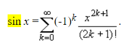

# Лабораторная работа #1

1. Для указанной функции провести модульное тестирование разложения функции в степенной ряд. Выбрать достаточное тестовое покрытие.
2. Провести модульное тестирование указанного алгоритма. Для этого выбрать характерные точки внутри алгоритма, и для предложенных самостоятельно наборов исходных данных записать последовательность попадания в характерные точки. Сравнить последовательность попадания с эталонной.
3. Сформировать доменную модель для заданного текста.  Разработать тестовое покрытие для данной доменной модели

- Функция `sin(x)`

- Программный модуль для `сортировки массива подсчетом` (http://www.cs.usfca.edu/~galles/visualization/CountingSort.html)
- Описание предметной области:

``Еще мгновение люди сидели молча, а потом человек, громко смеявшийся, засмеялся снова.
Девушка, которую он затащил с собой в бар, за последний час всем сердцем возненавидела его, и,
возможно, была бы рада узнать, что через полторы минуты он испарится, превратившись в
облачко водорода, озона и оксида углерода. Однако когда момент наступил, она была слишком
занята собственным испарением, чтобы обратить на это внимание.``
